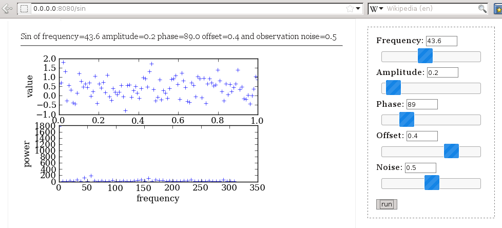

=======================================
WebSciPy
=======================================

WebSciPy allows you to make interactive web demos of scientific problems by 
connecting your scipy/numpy code and matplotlib plots with user-friendly, 
interactive web forms. Check it out!

Trying WebSciPy
--------------------------

Download the code and run:
   
   $ python test.py
   http://0.0.0.0:8080/

This should tell you the website to visit. Try the FFT and square root demo programs:

   
   The FFT demo program features interactive sliders and plotting capabilities.

Hacking WebSciPy
--------------------------

Download and fork this project on github. Put your own demo cases in your repo!

Open test.py. You find the routes that connect URLs with classes.
The sqrt class shows the minimal use case of connecting a input form to some calculations.
You will write a similar class for your code, then connect it in the routes.

A more elaborate example, with scipy libraries and matplotlib plotting is the sin class.

WebSciPy is built on web.py, so look at `their documentation <http://webpy.org/>`_. 

